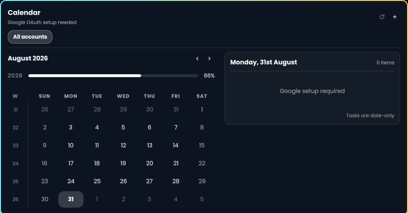

# Omarchy Google Calendar

Your Google calendars and tasks, together in the Omarchy bar.



- **One agenda:** meetings, all-day events, and dated tasks across accounts.
- **Quick access:** click the clock, browse dates, filter by account.
- **Cached reads:** opens immediately while the service syncs in the background.
- **Agent tools:** a namespaced CLI and automatically installed usage skill.

Calendar and Tasks access is **read-only**. Event and task editing are not supported.

## Install

Requires Omarchy with plugin support, Rust/Cargo (edition 2024), SQLite,
`pkg-config`, `secret-tool` (libsecret), `xdg-open` (xdg-utils), a browser,
and a user systemd session.

```bash
omarchy plugin add https://github.com/shivam-g10/omarchy-google-calendar.git --enable
~/.config/omarchy/plugins/shivam.clock/scripts/install-backend
```

Follow [Google OAuth setup](docs/google-oauth.md), then click **+** to connect accounts.
Setup requires your own Google Desktop OAuth client. Refresh tokens live in
Secret Service; cached calendar data lives in SQLite. The backend runs as a
user service and communicates over a private Unix socket.

## Everyday use

| Action | Where |
| --- | --- |
| Open calendar | Click the bar clock |
| Filter agenda | Choose an account |
| Connect / cancel sign-in | **+** / **×** |
| Reconnect expired access | **Sign in again** |
| Customize clock | Bar settings; try `dddd, {ordinal} MMM, HH:mm` |

Google OAuth apps in Testing can require sign-in again after seven days.
See [setup details](docs/google-oauth.md).

## Agent and CLI access

```bash
omarchy-calendar agenda list       # Today's events and tasks
omarchy-calendar event list        # Events only
omarchy-calendar task list         # Dated tasks only
omarchy-calendar --help            # All commands
```

The installer includes [the calendar skill](skills/omarchy-calendar/SKILL.md) at
`~/.codex/skills/omarchy-calendar/` (or `$CODEX_HOME/skills/omarchy-calendar/` when set).
Updates replace the skill; uninstall removes it. Use the same `CODEX_HOME` for both.

[CLI reference](docs/cli.md) covers date ranges, account management, JSON output,
explicit refresh, and sandbox access. Older root commands have moved into
`account`, `event`, `task`, `agenda`, and `service` namespaces.

## Update or remove

**Update** — rebuilds the backend and restarts its user service:

```bash
omarchy plugin update shivam.clock
~/.config/omarchy/plugins/shivam.clock/scripts/install-backend
```

**Remove**

1. Remove connected accounts in the calendar panel. This revokes Google tokens and clears their local credentials and cache.
2. Uninstall the backend and plugin:

```bash
~/.config/omarchy/plugins/shivam.clock/scripts/uninstall-backend
omarchy plugin remove shivam.clock --yes
```

Skipping step 1 retains account credentials and cached data.
The uninstaller removes the agent skill and preserves any user-added files in its folder.

## Resource footprint

Written in Rust to keep background RAM and CPU overhead low as desktop plugins accumulate.

Daemon memory snapshot. Shared-shell UI excluded.

| Memory measurement | MB |
| --- | ---: |
| Service memory (systemd) | 10.66 |
| Proportional memory (PSS) | 10.21 |

[MIT license](LICENSE) · [Third-party notices](THIRD_PARTY_NOTICES)
